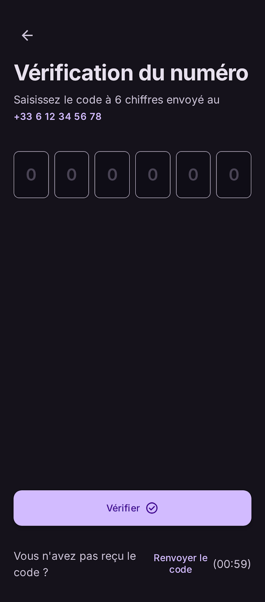

# User Story: US-101 — Phone OTP Authentication

**Story ID:** `US-101`
**Epic:** [EPIC-01: Core Infrastructure & Authentication](../README.md)
**Role:** Client & Driver
**Priority:** P0

---

## 1. User Story Statement
**As a** client or driver,  
**I want to** register and log in passwordlessly using my phone number and a 6-digit SMS OTP,  
**So that** I can authenticate quickly without managing passwords.

---

## 2. Implementation Status
* **Backend:** PARTIALLY IMPLEMENTED — `AuthController` exists with `/v1/auth/send-otp` and `/v1/auth/verify-otp` endpoints using `otps` and `users` tables in Laravel 13.
* **Mobile:** PARTIALLY IMPLEMENTED — Phone entry and OTP verification screens exist in `app/auth/`, but require alignment with the Stitch dark-mode Design System.

---

## 3. Design System & UI Specs

### Design System Reference Mockups





## 4. Business Rules & Technical Requirements

### 4.1 Phone Verification Workflow
* User enters phone number in E.164 format (e.g. `+212600000000`).
* Triggers API endpoint `POST /api/v1/auth/send-otp` which dispatches SMS via configured SMS gateway.
* Throttling rule: Maximum 1 OTP dispatch request per phone number per 60 seconds.

### 4.2 OTP Verification & Sanctum Token Issuance
* User submits 6-digit code to `POST /api/v1/auth/verify-otp`.
* Invalidation policy: Code expires after 5 minutes or after 3 consecutive failed verification attempts.
* On verification success, backend creates or retrieves user record and returns Laravel Sanctum Bearer token (`plainTextToken`).

---

## 5. Acceptance Criteria (Gherkin)

```gherkin
Scenario: Successful OTP authentication
  Given I am on the login screen styled with "bg-inhaz-dark" canvas
  When I select Morocco "+212" flag and enter phone "612345678"
  And I tap "Envoyer le code" CTA styled with "bg-inhaz-purple"
  Then an SMS OTP is dispatched
  And 6 monospace digit boxes appear with a 60-second resend countdown timer

Scenario: Maximum failed verification attempts threshold
  Given I received an OTP code on my phone
  When I enter incorrect 6-digit OTP codes 3 times consecutively
  Then the system invalidates the OTP code
  And displays a localized error message prompting me to request a new code
```
