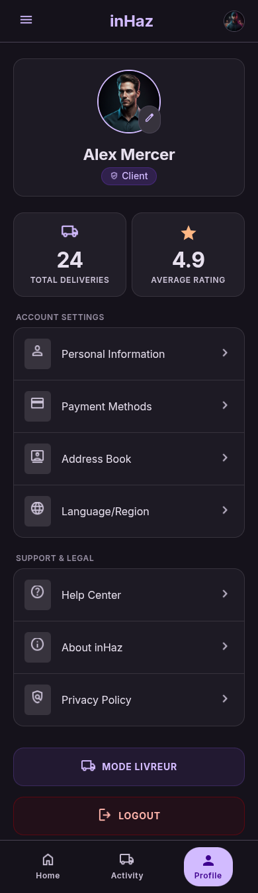

# User Story: US-103 — Dual-Role Switching (Client / Driver)

**Story ID:** `US-103`
**Epic:** [EPIC-01: Core Infrastructure & Authentication](../README.md)
**Role:** Client & Driver
**Priority:** P0

---

## 1. User Story Statement
**As a** registered inHaz user who acts as both a shipping customer and a freight delivery driver,  
**I want to** toggle seamlessly between Client mode and Driver mode from my profile menu,  
**So that** I can switch between ordering deliveries and earning money as a verified driver.

---

## 2. Implementation Status
* **Backend:** PARTIALLY IMPLEMENTED — Role flags and Sanctum token context validation in place.
* **Mobile:** PARTIALLY IMPLEMENTED — UI toggle exists, pending document verification guard integration.

---

## 3. Design System & UI Specs

### Design System Reference Mockups



## 4. Business Rules & Technical Requirements

### 4.1 Default Mode Policy
* All new users default to **Client mode** upon initial account registration and first login.

### 4.2 Role Switch Verification Guards
* When a user attempts to switch from Client mode $\rightarrow$ Driver mode via `profil_avec_mode_livreur`:
  1. The app queries backend `GET /api/v1/driver/profile/status`.
  2. The backend validates whether all 4 required driver documents exist and are verified:
     - `CIN` (National Identity Card)
     - `carte_grise` (Vehicle Registration)
     - `assurance` (Vehicle Insurance)
     - `permis_professionnel` (Professional Driving Permit)
  3. If `verification_status != 'approved'`, mode switch is blocked and user is directed to driver document upload onboarding (Epic 02).
  4. If `verification_status == 'approved'`, UI switches immediately to the Driver Dashboard view.

---

## 5. Acceptance Criteria (Gherkin)

```gherkin
Scenario: First-time login defaults to Client mode
  Given I completed phone OTP authentication as a new user
  When I launch the mobile app for the first time
  Then the default active screen is the Client delivery request feed

Scenario: Unverified driver blocked from switching to Driver mode
  Given I am logged in as Client and my driver documents are pending approval
  When I tap "Passer en mode livreur" on profil_avec_mode_livreur screen
  Then I am presented with a modal explaining driver verification is pending
  And access to the Driver Dashboard remains locked

Scenario: Approved driver switches role context
  Given my driver profile document status is fully "approved"
  When I tap "Passer en mode livreur"
  Then the active UI context switches to Driver Mode
  And the Electric Purple ("#7928CA") active mode badge reflects Driver Mode
```
