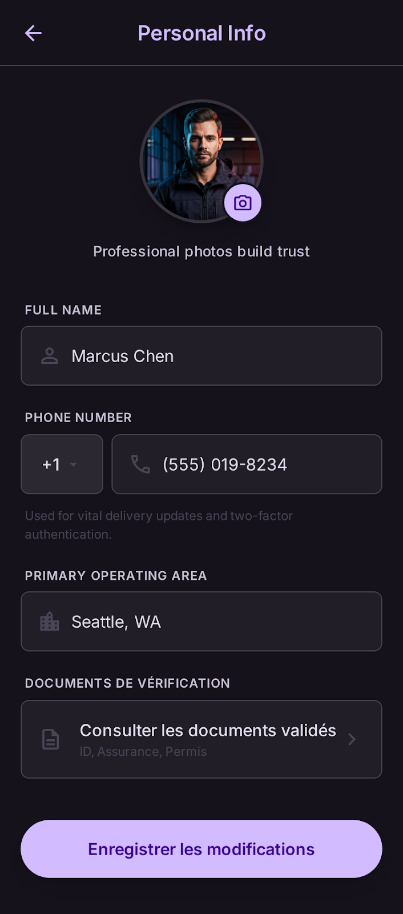

# User Story: US-104 — Personal Info & Profile Edit Screen

**Story ID:** `US-104`
**Epic:** [EPIC-01: Core Infrastructure & Authentication](../README.md)
**Role:** Client / Driver / All
**Priority:** P1

---

## 1. User Story Statement
**As an** inHaz app user,  
**I want to** view and edit my personal details (full name, avatar photo) while viewing my verified phone number,  
**So that** my profile information remains accurate and recognizable for delivery transactions.

---

## 2. Implementation Status
* **Backend:** NOT STARTED — Profile avatar upload and update endpoints (`PATCH /api/v1/profile`, `POST /api/v1/profile/avatar`) to be implemented in Laravel 13.
* **Mobile:** NOT STARTED — UI screen `informations_personnelles` pending development in Expo app.

---

## 3. Design System & UI Specs

### Design System Reference Mockups



## 4. Business Rules & Technical Requirements

### 4.1 Profile Update API
* Editable fields: `first_name`, `last_name`, `email`.
* Read-only fields: `phone_number` (changes strictly governed by re-verification via OTP).
* Endpoint `PATCH /api/v1/profile` updates user attributes in Laravel 13 backend.

### 4.2 Profile Picture Media Storage
* Avatar upload via `POST /api/v1/profile/avatar` sending `multipart/form-data`.
* Stored using **Laravel Filesystem** (S3 compatible object storage).
* Generates optimized thumbnail URL stored in `users.avatar_url`.

---

## 5. Acceptance Criteria (Gherkin)

```gherkin
Scenario: Updating full name on informations_personnelles screen
  Given I am on the "informations_personnelles" screen with dark background ("bg-inhaz-dark")
  When I update my name field to "Amine Bennani"
  And I tap the "Enregistrer" CTA button ("bg-inhaz-purple")
  Then an HTTP PATCH request is sent to /api/v1/profile
  And my profile updates successfully across the app

Scenario: Profile picture selection and upload
  Given I select a picture from my device gallery
  When the image uploads via POST /api/v1/profile/avatar
  Then the file is stored via Laravel Filesystem (S3)
  And my avatar photo preview updates in the profile header
```
