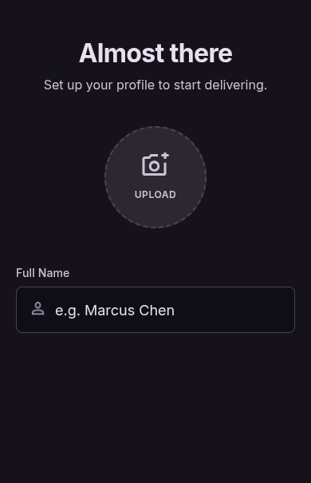

# User Story: US-105 — Profile Configuration & Notification Preferences

**Story ID:** `US-105`
**Epic:** [EPIC-01: Core Infrastructure & Authentication](../README.md)
**Role:** All
**Priority:** P1

---

## 1. User Story Statement
**As an** inHaz app user,  
**I want to** manage my application settings and push notification preferences from a central configuration screen,  
**So that** I can control which alerts (trip updates, promotional offers, bidding activity) I receive.

---

## 2. Implementation Status
* **Backend:** NOT STARTED — Notification preference persistence endpoints in Laravel 13 backend pending.
* **Mobile:** NOT STARTED — UI screen `configuration_du_profil` pending development in Expo app.

---

## 3. Design System & UI Specs

### Design System Reference Mockups



## 4. Business Rules & Technical Requirements

### 4.1 Notification Preferences Management
* Toggle options provided:
  - `Push Notifications` (Master switch)
  - `Trip & Bidding Updates` (Real-time order/bid notifications)
  - `Promotions & News` (Marketing notifications)
  - `Sound & Vibration` (In-app alert sounds)
* Preferences serialized and saved to user profile settings (`users.notification_settings` JSON column in DB).
* Endpoint: `PATCH /api/v1/profile/preferences`.

### 4.2 Push Token Registration
* Integrates Expo Push Notification SDK token registration with backend `POST /api/v1/notifications/device-token`.

---

## 5. Acceptance Criteria (Gherkin)

```gherkin
Scenario: Updating notification toggles on configuration_du_profil screen
  Given I am on the "configuration_du_profil" screen with dark background ("bg-inhaz-dark")
  When I toggle off "Promotions & News" switch
  Then the switch color changes from Electric Purple ("#7928CA") to subtle grey
  And an HTTP PATCH request sends updated preferences JSON to /api/v1/profile/preferences
  And marketing push notifications are disabled for my account
```
