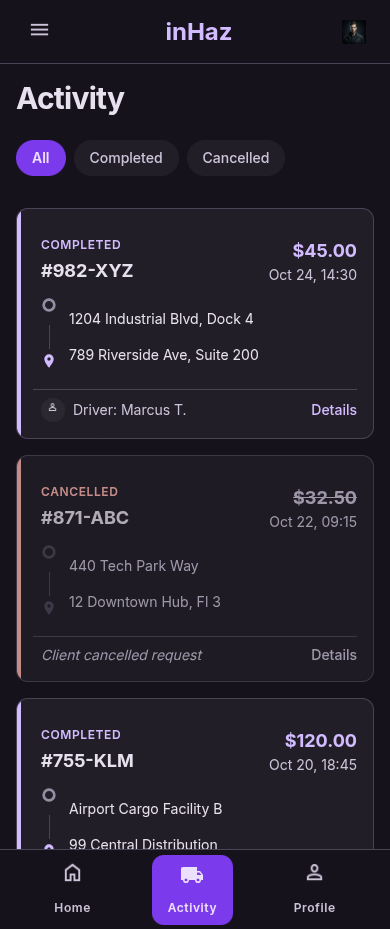

# User Story: US-106 — Activity History Screen

**Story ID:** `US-106`
**Epic:** [EPIC-01: Core Infrastructure & Authentication](../README.md)
**Role:** Client / Driver / All
**Priority:** P1

---

## 1. User Story Statement
**As an** inHaz client or driver,  
**I want to** view a timeline history of all my past delivery requests and completed trips with status badges and financial details,  
**So that** I can review past activity, check delivery receipts, and track earnings or expenses.

---

## 2. Implementation Status
* **Backend:** NOT STARTED — Activity history endpoints (`GET /api/v1/client/requests/history`, `GET /api/v1/driver/trips/history`) pending in Laravel 13.
* **Mobile:** NOT STARTED — UI screen `historique_des_activit_s` pending development in Expo app.

---

## 3. Design System & UI Specs

### Design System Reference Mockups



## 4. Business Rules & Technical Requirements

### 4.1 Role-Aware History Fetching
* In Client mode: Fetches user's delivery requests from `delivery_requests` table via `GET /api/v1/client/requests/history`.
* In Driver mode: Fetches completed trips from `trips` table via `GET /api/v1/driver/trips/history`.

### 4.2 Financial Display Rules
* Prices displayed in Moroccan Dirhams (MAD). Minimum delivery price displayed is 20 MAD (enforced by `system_settings` config).
* Cards display payment method indicator (Cash on Delivery).

---

## 5. Acceptance Criteria (Gherkin)

```gherkin
Scenario: Client views past delivery request history
  Given I am logged in as Client on the "historique_des_activit_s" screen
  When the screen loads on dark canvas ("bg-inhaz-dark")
  Then a timeline list of past delivery requests is displayed
  And each card shows status badges, route details, and price in MAD (>= 20 MAD)

Scenario: Driver views completed trip earnings history
  Given I am logged in as Driver on "historique_des_activit_s" screen
  When the screen loads
  Then completed driver trips are rendered with earnings summary in MAD
```
