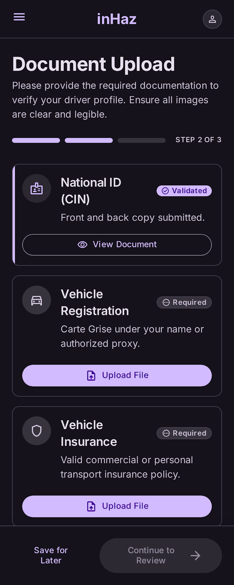

# User Story: US-201 — Driver Document Upload (Mobile)

**Story ID:** `US-201`
**Epic:** [EPIC-02: Driver Onboarding & Verification](../README.md)
**Role:** Driver
**Priority:** P0

---

## 1. User Story Statement
**As an** aspiring driver,
**I want to** upload photos of my 4 mandatory verification documents along with their expiry dates in a 2-column grid,
**So that** platform administrators can verify my identity, vehicle eligibility, and professional licensing before I start accepting delivery requests.

---

## 2. Implementation Status
* **Backend:** PARTIALLY IMPLEMENTED — Endpoint `POST /api/v1/driver/documents` and document storage handlers exist, backed by Laravel Filesystem (private S3 bucket).
* **Mobile:** NOT STARTED — Interface screen `inscription_livreur_documents` requires full layout implementation using Expo SDK 57.

---

## 3. Design System & UI Specs

### Design System Reference Mockups



## 4. Business Rules & Technical Requirements
### 4.1 Mandatory Document Requirements
1. **CIN (Carte d'Identité Nationale):** Mandatory national identity card photo + expiry date.
2. **Carte Grise:** Mandatory vehicle registration document photo + expiry date.
3. **Attestation d'Assurance:** Mandatory vehicle insurance certificate photo + expiry date.
4. **Permis Professionnel:** Mandatory professional driver license photo + expiry date.

### 4.2 Endpoint & Storage Specifications (`POST /api/v1/driver/documents`)
* **Headers:** `Authorization: Bearer <token>`, `Content-Type: multipart/form-data`.
* **Payload:** `document_type` (`cin`, `carte_grise`, `assurance`, `permis_professionnel`), `file` (image/jpeg, image/png, max 10MB), `expires_at` (YYYY-MM-DD).
* **Storage Layer:** Stored in private S3-compatible bucket via Laravel Filesystem (`Storage::disk('s3')`). File paths saved as `documents/{driver_id}/{document_type}_{timestamp}.jpg`.
* **Profile State Update:** Upon uploading all 4 mandatory documents, sets `driver_profiles.verification_status = 'pending'`.

---

## 5. Acceptance Criteria (Gherkin)

```gherkin
Scenario: Successfully uploading all 4 mandatory driver documents with expiry dates
  Given I am on the "inscription_livreur_documents" screen with dark theme "bg-inhaz-dark"
  When I upload photos for CIN, Carte Grise, Assurance, and Permis Professionnel in the 2-column grid
  And I set valid expiry dates for each document
  And I tap the "Submit Documents for Verification" CTA button ("bg-inhaz-purple", "rounded-sheet")
  Then all 4 files are securely stored in private S3 storage via Laravel Filesystem
  And my driver verification status changes to "pending"
  And the completion progress bar displays 100% (4/4)

Scenario: Validation error when uploading without expiry date
  Given I am uploading a photo for "Attestation d'Assurance"
  When I attempt to submit without selecting an expiry date
  Then an inline error message appears prompting for the document expiry date
  And document submission is blocked
```
