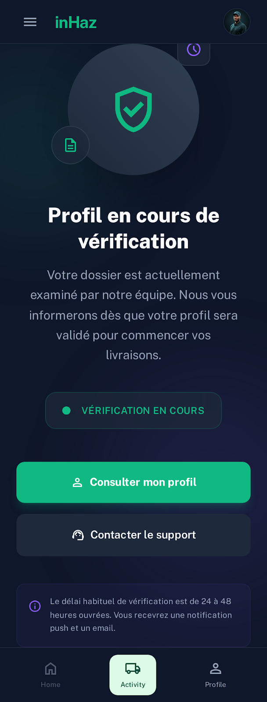

# User Story: US-202 — Driver Pending Validation Status Screen

**Story ID:** `US-202`
**Epic:** [EPIC-02: Driver Onboarding & Verification](../README.md)
**Role:** Driver
**Priority:** P0

---

## 1. User Story Statement
**As a** driver who has submitted verification documents,
**I want to** view my pending validation status screen showing submission details, expected review timeframes, and per-document approval statuses,
**So that** I stay informed about my verification progress and know how to resolve any rejected document issues.

---

## 2. Implementation Status
* **Backend:** NOT STARTED — Requires `GET /api/v1/driver/verification-status` API endpoint delivering document status objects and review timeline metadata.
* **Mobile:** NOT STARTED — Screen component `profil_en_attente_de_validation` needs to be created in Expo SDK 57.

---

## 3. Design System & UI Specs

### Design System Reference Mockups



## 4. Business Rules & Technical Requirements
### 4.1 Status Flow & Polling
* **Verification Status States:** `pending`, `partially_approved`, `approved`, `rejected`.
* **Realtime Updates:** Listens for WebSocket event `DriverVerificationUpdated` via Laravel Reverb to auto-refresh status without manual page pull.
* **Support Integration:** Tapping "Contact Support" pre-fills support chat / WhatsApp modal with driver ID and document rejection details.

### 4.2 API Contract (`GET /api/v1/driver/verification-status`)
* **Headers:** `Authorization: Bearer <token>`
* **Response Structure:**
  ```json
  {
    "submitted_at": "2026-08-29T10:00:00Z",
    "expected_review_window": "24-48 hours",
    "overall_status": "pending",
    "documents": [
      { "type": "cin", "status": "approved", "rejection_reason": null },
      { "type": "carte_grise", "status": "pending", "rejection_reason": null },
      { "type": "assurance", "status": "rejected", "rejection_reason": "Expired document photo" },
      { "type": "permis_professionnel", "status": "pending", "rejection_reason": null }
    ]
  }
  ```

---

## 5. Acceptance Criteria (Gherkin)

```gherkin
Scenario: Viewing pending driver verification status
  Given I am an authenticated driver with status "pending"
  When I open the "profil_en_attente_de_validation" screen
  Then I see my submission date and expected review window ("24–48 hours")
  And I see 4 individual document status badges reflecting current verification states

Scenario: Contacting support for rejected document
  Given one of my uploaded documents ("Assurance") has been rejected by an admin
  When I view the "profil_en_attente_de_validation" screen
  Then the Assurance card displays a red "Rejected" badge with the reason "Expired document photo"
  And the "Contact Support" button ("bg-inhaz-purple", "rounded-sheet") is enabled
```
