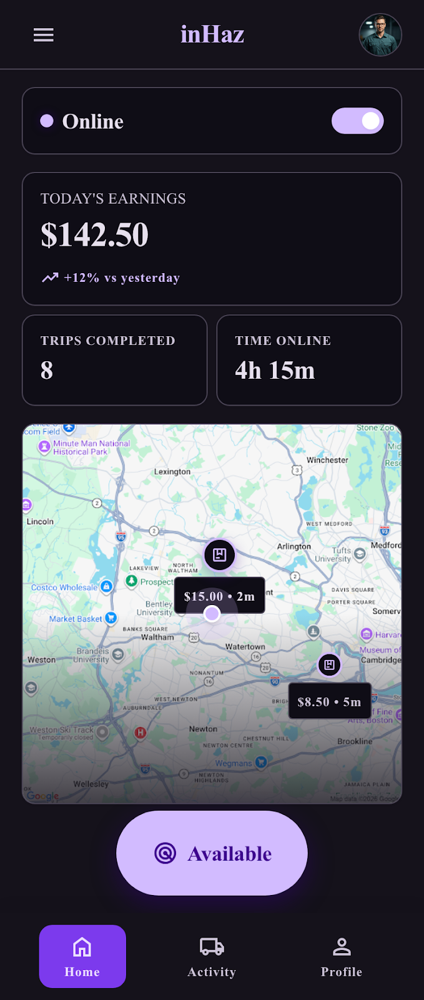

# User Story: US-204 — Driver Operational Dashboard Screen

**Story ID:** `US-204`
**Epic:** [EPIC-02: Driver Onboarding & Verification](../README.md)
**Role:** Driver
**Priority:** P0

---

## 1. User Story Statement
**As an** approved active driver,
**I want to** access a dedicated driver operational dashboard with an online status toggle, daily earnings summary, platform commission balance, and completed trips count,
**So that** I can easily toggle my availability, track my financial metrics in MAD, and quickly jump to nearby delivery requests.

---

## 2. Implementation Status
* **Backend:** NOT STARTED — API endpoints for driver toggle `PATCH /api/v1/driver/toggle-online` and dashboard summary `GET /api/v1/driver/dashboard-summary` need to be implemented.
* **Mobile:** NOT STARTED — Screen component `tableau_de_bord_livreur` needs to be created in Expo SDK 57.

---

## 3. Design System & UI Specs

### Design System Reference Mockups



## 4. Business Rules & Technical Requirements
### 4.1 Driver Availability & Online Toggle
* Toggling "Online" sends GPS position updates to backend Redis spatial cache (`POST /api/v1/driver/location`) every 10 seconds.
* Drivers can only switch to "Online" mode if their `verification_status` is `approved` and commission debt does not exceed hard cutoff threshold (e.g. 200 MAD).

### 4.2 API Contract (`GET /api/v1/driver/dashboard-summary`)
* **Headers:** `Authorization: Bearer <token>`
* **Response Payload:**
  ```json
  {
    "is_online": true,
    "today_earnings_mad": 450.00,
    "commission_balance_mad": 45.00,
    "completed_trips_today": 8,
    "active_trip_id": null
  }
  ```

---

## 5. Acceptance Criteria (Gherkin)

```gherkin
Scenario: Toggling driver online status on dashboard
  Given I am an approved driver on the "tableau_de_bord_livreur" screen with "bg-inhaz-dark" theme
  When I tap the availability toggle switch to "Online"
  Then my status changes to online (green indicator `#00C853`)
  And background location tracking starts sending coordinates to Laravel backend

Scenario: Viewing financial summary and navigating to request feed
  Given I am viewing the driver operational dashboard
  When the screen loads
  Then I see today's earnings in MAD, commission balance owed in MAD, and completed trips count
  And tapping the "Browse Nearby Requests" button ("bg-inhaz-purple", "rounded-sheet") opens the live nearby delivery requests feed
```
