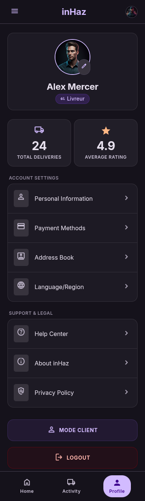

# User Story: US-205 — Driver Profile Screen (Driver Mode)

**Story ID:** `US-205`
**Epic:** [EPIC-02: Driver Onboarding & Verification](../README.md)
**Role:** Driver
**Priority:** P1

---

## 1. User Story Statement
**As a** verified driver,
**I want to** view my dedicated driver profile screen showing my vehicle specs, rating score, verification badge, total completed trips, and financial ledger link,
**So that** I can manage my professional profile details and access my commission accounting balance.

---

## 2. Implementation Status
* **Backend:** NOT STARTED — Endpoint `GET /api/v1/driver/profile` delivering driver vehicle details, rating stats, and ledger summary needs to be implemented.
* **Mobile:** NOT STARTED — Screen component `profil_en_mode_livreur` needs to be created in Expo SDK 57.

---

## 3. Design System & UI Specs

### Design System Reference Mockups



## 4. Business Rules & Technical Requirements
### 4.1 Rating & Badge Computation
* `average_rating` and `total_reviews` computed dynamically from `ratings` table for trips where role = `driver`.
* `verification_badge` active only if `driver_profiles.verification_status == 'approved'`.

### 4.2 API Contract (`GET /api/v1/driver/profile`)
* **Headers:** `Authorization: Bearer <token>`
* **Response Payload:**
  ```json
  {
    "full_name": "Youssef El Alami",
    "phone": "+212612345678",
    "verification_status": "approved",
    "verification_badge": true,
    "rating_score": 4.85,
    "total_reviews": 124,
    "completed_trips_count": 342,
    "vehicle": {
      "type": "triporteur",
      "plate_number": "12345-A-6",
      "make_model": "Yamaha Triporteur 250cc"
    }
  }
  ```

---

## 5. Acceptance Criteria (Gherkin)

```gherkin
Scenario: Viewing driver profile details in Driver Mode
  Given I am logged in as an approved driver
  When I open the "profil_en_mode_livreur" screen with "bg-inhaz-dark" theme
  Then I see my photo, name, and green "Verified Driver" badge
  And I see my vehicle details ("Triporteur", "12345-A-6") and rating score ("4.85 ★")
  And I see my total completed trips count ("342 trips")

Scenario: Navigating to driver accounting ledger from profile
  Given I am on the "profil_en_mode_livreur" screen
  When I tap the "Commission & Accounting Ledger" button ("bg-inhaz-purple", "rounded-sheet")
  Then the app navigates to the driver commission ledger screen
```
