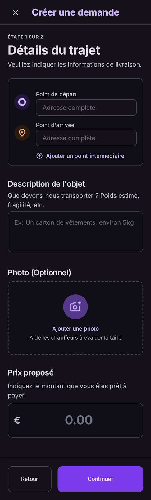

# User Story: US-301 — Client Delivery Request Form & Photo Capture

**Story ID:** `US-301`
**Epic:** [EPIC-03: Request Creation & Geospatial Infrastructure](../README.md)
**Role:** Client
**Priority:** P0

---

## 1. User Story Statement
**As a** client,
**I want to** complete a 4-step delivery request wizard specifying pickup/dropoff locations, package details with inline camera photo capture, vehicle requirements, and a proposed price,
**So that** I can publish my delivery request to nearby drivers with an initial price offer above the 20 MAD minimum floor.

---

## 2. Implementation Status
* **Backend:** PARTIALLY IMPLEMENTED — `DeliveryRequestController` handles creation (`POST /v1/requests`), stops, and photo uploads (`POST /v1/requests/{id}/photos`).
* **Mobile:** NOT STARTED — Interface screen `cr_er_une_demande` multi-step wizard requires full alignment with Expo SDK 57 and inHaz Design System.

---

## 3. Design System & UI Specs

### Design System Reference Mockups



## 4. Business Rules & Technical Requirements
### 4.1 Package Photo Capture & Client Compression
* Integrated in Step 2 of wizard. Uses `expo-image-picker` with `mediaTypes: Images`.
* Native camera capture or device gallery upload supported.
* Client-side image compression automatically applied to reduce package photo file size to **<= 2 MB** before API transmission.

### 4.2 Pricing Rules & Minimum Price Floor
* Recommended price auto-computed via distance matrix and vehicle rate multiplier.
* User can adjust proposed price up or down, but system enforces a hard floor: **proposed_price >= 20.00 MAD** (configurable via `system_settings`).
* If user attempts to enter a price below 20 MAD, the UI caps it at 20 MAD and displays a notification banner ("Minimum platform delivery fee is 20 MAD").

### 4.2 Endpoint Specifications (`POST /api/v1/requests`)
* **Headers:** `Authorization: Bearer <token>`, `Content-Type: application/json`
* **Payload:**
  ```json
  {
    "origin_address": "Av. Hassan II, Agadir",
    "origin_latitude": 30.4278,
    "origin_longitude": -9.5981,
    "destination_address": "Souk El Had, Agadir",
    "destination_latitude": 30.4125,
    "destination_longitude": -9.5822,
    "package_description": "2 cartons of electronics",
    "package_weight_kg": 15.5,
    "vehicle_type": "triporteur",
    "proposed_price": 40.00
  }
  ```

---

## 5. Acceptance Criteria (Gherkin)

```gherkin
Scenario: Completing 4-step request creation wizard with valid proposed price
  Given I am on step 1 of "cr_er_une_demande" with dark theme "bg-inhaz-dark"
  When I select pickup and dropoff locations using my Address Book
  And I add package description "Documents" and attach a photo in step 2
  And I select vehicle type "Triporteur" in step 3
  And I adjust my proposed price to 40 MAD in step 4
  And I tap "Publish Delivery Request" ("bg-inhaz-purple", "rounded-sheet")
  Then the delivery request is created in state "open" and broadcast to nearby drivers

Scenario: Enforcing minimum price floor of 20 MAD
  Given I am on step 4 of the request creation wizard
  When I enter a proposed price of 15 MAD
  Then the price field auto-corrects to 20 MAD
  And an inline error banner displays "Minimum delivery fee is 20 MAD"
```
