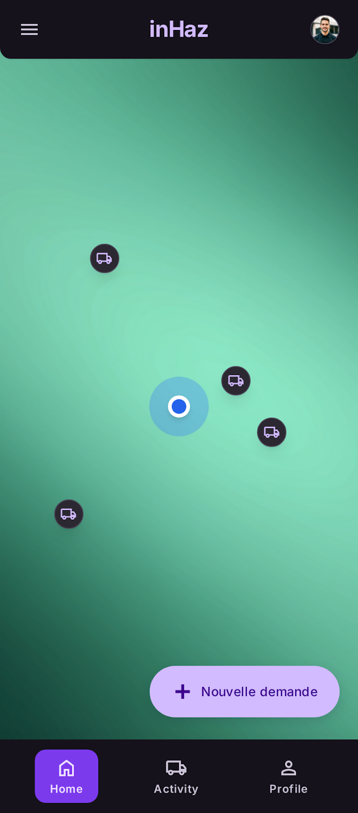

# User Story: US-302 — Google Maps Integration & Location Picker

**Story ID:** `US-302`
**Epic:** [EPIC-03: Request Creation & Geospatial Infrastructure](../README.md)
**Role:** Client & Driver
**Priority:** P0

---

## 1. User Story Statement
**As a** user selecting delivery locations or viewing active drivers,
**I want to** interact with a full-screen dark-styled Google Map showing live animated nearby driver pins, autocomplete search, and a center crosshair pin picker,
**So that** I can accurately set pickup/dropoff coordinates and visually confirm nearby driver availability.

---

## 2. Implementation Status
* **Backend:** PARTIALLY IMPLEMENTED — Laravel backend exposes proxy routes `GET /api/v1/maps/autocomplete` and `GET /api/v1/maps/reverse-geocode` to cache Google Maps API responses securely.
* **Mobile:** PARTIALLY IMPLEMENTED — Map view exists in Expo SDK 57 (`react-native-maps`), but requires integration of dark map JSON styling, animated marker pins, slide-up bottom sheet, and center crosshair mode.

---

## 3. Design System & UI Specs

### Design System Reference Mockups



## 4. Business Rules & Technical Requirements
### 4.1 Geocoding & Autocomplete Restrictions
* Autocomplete query results are restricted to Morocco bounding box (`country:ma`).
* Reverse geocoding resolves map center lat/lng coordinates to structured street address strings.
* Real-time driver pin markers fetched from Redis spatial cache (`GEOSEARCH`) within a 5km radius.

### 4.2 API Proxy Contract (`GET /api/v1/maps/autocomplete`)
* **Query Parameters:** `input` (string), `session_token` (string)
* **Response:** Array of address predictions formatted for Expo dropdown component.

---

## 5. Acceptance Criteria (Gherkin)

```gherkin
Scenario: Searching address via Places Autocomplete on dark map
  Given I am on the "accueil_avec_map_et_livreurs" screen with full-screen dark map style
  When I type "Boulevard Hassan II" into the slide-up bottom sheet address search bar
  And I select "Boulevard Hassan II, Agadir" from autocomplete suggestions
  Then the map animates and centers camera over selected coordinates
  And a purple destination marker ("#7928CA") drops at the selected point

Scenario: Choosing pickup location using Pin-on-Map center crosshair
  Given I switch to "cr_er_une_demande_vue_carte" pin picker mode
  When I drag the map under the fixed center crosshair icon
  Then the top address pill dynamically updates with reverse-geocoded street address as panning stops
  And tapping "Confirm Location" ("bg-inhaz-purple", "rounded-sheet") passes the exact lat/lng to request wizard
```
