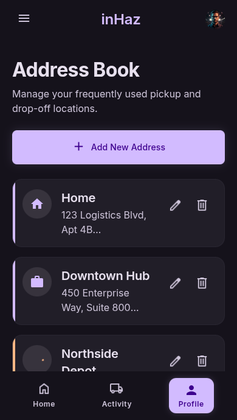

# User Story: US-304 — Address Book / Saved Locations Screen

**Story ID:** `US-304`
**Epic:** [EPIC-03: Request Creation & Geospatial Infrastructure](../README.md)
**Role:** Client
**Priority:** P0

---

## 1. User Story Statement
**As a** client,
**I want to** save, manage, and label my frequently used pickup and dropoff locations (such as Home, Work, or Warehouses) in an Address Book screen,
**So that** I can instantly select saved addresses during delivery request creation without re-typing or searching on the map.

---

## 2. Implementation Status
* **Backend:** NOT STARTED — API endpoints for address book CRUD (`GET /api/v1/client/addresses`, `POST /api/v1/client/addresses`, `DELETE /api/v1/client/addresses/{id}`) need to be implemented.
* **Mobile:** NOT STARTED — Interface screen `carnet_d_adresses` and quick-select modal component need to be created in Expo SDK 57.

---

## 3. Design System & UI Specs

### Design System Reference Mockups



## 4. Business Rules & Technical Requirements
### 4.1 Address Book Data Management
* Client can store up to 20 saved locations.
* Each entry requires `label`, `formatted_address`, `latitude`, `longitude`.
* Optional fields: `building_number`, `floor_door`, `contact_name`, `contact_phone`.
* Selecting an address from the Address Book auto-fills latitude, longitude, address text, and recipient contact details directly into Step 1 of the request creation wizard (`cr_er_une_demande`).

### 4.2 Endpoint Specifications (`POST /api/v1/client/addresses`)
* **Headers:** `Authorization: Bearer <token>`, `Content-Type: application/json`
* **Payload:**
  ```json
  {
    "label": "Maison",
    "icon_type": "home",
    "address": "12 Rue des Palmiers, Agadir",
    "latitude": 30.4211,
    "longitude": -9.5899,
    "contact_name": "Amina",
    "contact_phone": "+212661234567"
  }
  ```

---

## 5. Acceptance Criteria (Gherkin)

```gherkin
Scenario: Adding a new saved address to Address Book
  Given I am on the "carnet_d_adresses" screen with "bg-inhaz-dark" theme
  When I tap "Add New Saved Address" ("bg-inhaz-purple", "rounded-sheet")
  And I enter label "Work", address "Zone Industrielle Tassila", and lat/lng coordinates
  And I tap "Save Location"
  Then the new address card appears in my Address Book under category "Work"

Scenario: Fast selecting a saved address during request creation
  Given I am in Step 1 of the delivery request creation wizard
  When I tap the "Select from Address Book" button
  And I tap my saved location "Dépôt Principal"
  Then the pickup address, coordinates, and contact details are instantly pre-filled
```
