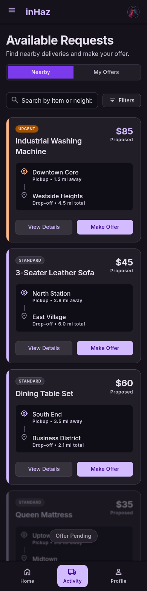

# User Story: US-401 — Driver Nearby Request Feed & Quick Bidding

**Story ID:** `US-401`
**Epic:** [EPIC-04: Reverse Bidding & Negotiation Engine](../README.md)
**Role:** Driver
**Priority:** P0

---

## 1. User Story Statement
**As a** Driver,
**I want to** view nearby delivery requests and quickly submit bids or counter-offers,
**So that** I can secure delivery jobs efficiently with minimal interaction while driving.

---

## 2. Implementation Status
* **Backend:** NOT STARTED — `DeliveryRequestController@browse` and `OfferController@store` pending implementation.
* **Mobile:** NOT STARTED — Driver nearby request feed UI and quick bidding components pending integration.

---

## 3. Design System & UI Specs

### Design System Reference Mockups



## 4. Business Rules & Technical Requirements
### 4.1 Nearby Request Filtering
* Drivers can view open delivery requests matching their vehicle type within a configurable distance radius (default 15km).
* Requests created by or currently assigned to the logged-in driver are excluded.

### 4.2 Quick Bidding & Minimum Pricing
* All submitted bids must be equal to or greater than the minimum delivery price of 20 MAD (configurable in `system_settings`).
* Quick percentage counters (+10%, +20%) calculate based on the client's initial proposed price, rounded to the nearest integer MAD.

### 4.3 Realtime Dispatch
* Submitting an offer via `POST /api/v1/requests/{id}/offers` dispatches a WebSocket broadcast event over Laravel Reverb to the channel `private-request.{id}` within 200ms.

---

## 5. Acceptance Criteria (Gherkin)

```gherkin
Scenario: Driver views nearby delivery requests with radius filters
  Given I am logged in as a verified driver with status "ONLINE"
  When I open the "demandes_proximit_livreur" screen
  Then I see open delivery requests within my selected distance filter
  And I can toggle between Map and List view modes at the top

Scenario: Driver submits a quick counter-offer
  Given a nearby request card is displayed with proposed price "60 MAD"
  When I tap the "+20%" quick-bid pill button
  Then an offer of "72 MAD" is submitted to the backend
  And the offer streams immediately to the client via Laravel Reverb

Scenario: Driver attempts to submit bid below minimum price limit
  Given a request card with proposed price "15 MAD"
  When I tap "Accept" or enter a custom price of "15 MAD"
  Then the system rejects the offer with a validation error "Le montant minimum est de 20 MAD"
```
