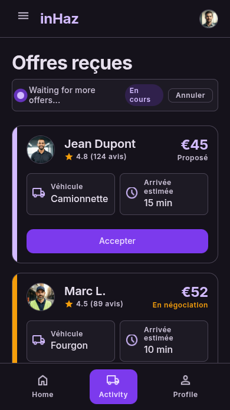

# User Story: US-402 — Client Realtime Offer Stream & Acceptance Locking

**Story ID:** `US-402`
**Epic:** [EPIC-04: Reverse Bidding & Negotiation Engine](../README.md)
**Role:** Client
**Priority:** P0

---

## 1. User Story Statement
**As a** Client,
**I want to** receive driver offers in real-time and accept the best offer atomically,
**So that** I can secure a driver immediately without double-booking or race conditions.

---

## 2. Implementation Status
* **Backend:** NOT STARTED — Real-time event broadcasting via Laravel Reverb and DB atomic locking (`lockForUpdate()`) pending implementation.
* **Mobile:** NOT STARTED — Realtime offer stream card stack and acceptance confirmation modal pending UI integration.

---

## 3. Design System & UI Specs

### Design System Reference Mockups



## 4. Business Rules & Technical Requirements
### 4.1 Real-Time Streaming (Laravel Reverb)
* Frontend subscribes to `private-request.{id}` via Laravel Echo using Sanctum Bearer authorization.
* Incoming bids append dynamically to the offer stack within <200ms latency without full screen reload.

### 4.2 Concurrency Control & Database Locking
* Offer acceptance endpoint `POST /api/v1/offers/{id}/accept` opens a database transaction via `DB::transaction()`.
* The target request row is locked using `DeliveryRequest::where('id', $id)->lockForUpdate()->first()`.

### 4.3 Atomic State Updates & Rejection
* The system verifies the request status is `open`.
* Request status transitions to `matched`, assigning `driver_id`.
* The accepted offer status updates to `accepted`, and all competing active offers for that request are updated to `rejected`.

---

## 5. Acceptance Criteria (Gherkin)

```gherkin
Scenario: Client views incoming driver offers in real-time
  Given I am viewing my active request on screen "offres_re_ues_sans_contre_offre"
  When a driver submits a new offer of "75 MAD"
  Then the new offer card appears at the top of the stack within <200ms
  And displays driver avatar, name, rating stars, price badge, and vehicle icon

Scenario: Client accepts driver offer atomically
  Given I am viewing stacked offers for an open delivery request
  When I tap "Accept" on a 75 MAD offer card
  And I confirm acceptance in the confirmation modal
  Then the backend executes an atomic transaction with lockForUpdate()
  And sets request status to "matched" with the chosen driver
  And automatically marks all other competing offers as "rejected"

Scenario: Concurrent acceptance attempt on already matched request
  Given another client session or process has just accepted an offer for the request
  When I attempt to accept a competing offer
  Then the request lock prevents duplicate assignment
  And the backend returns an error "Cette demande a déjà été acceptée"
```
