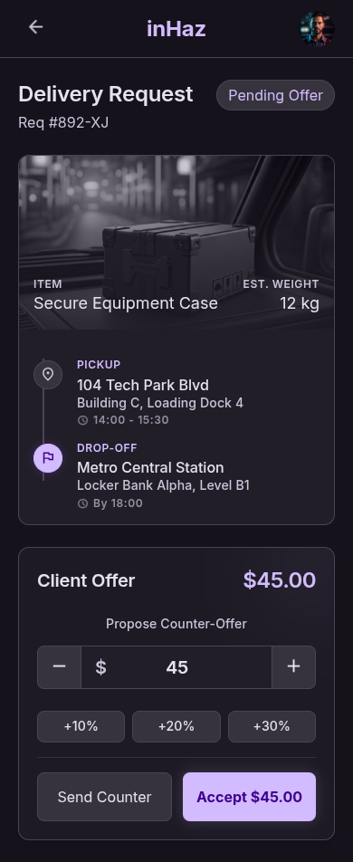

# User Story: US-403 — Counter-Offer Negotiation Flow

**Story ID:** `US-403`
**Epic:** [EPIC-04: Reverse Bidding & Negotiation Engine](../README.md)
**Role:** Client / Driver
**Priority:** P1

---

## 1. User Story Statement
**As a** Client or Driver,
**I want to** counter-offer proposed delivery prices and review detailed driver profiles,
**So that** we can reach a mutually agreed price before confirming the delivery.

---

## 2. Implementation Status
* **Backend:** NOT STARTED — Counter-offer negotiation state logic and history logging pending implementation.
* **Mobile:** NOT STARTED — Negotiation thread component and driver detail full-screen modal pending implementation.

---

## 3. Design System & UI Specs

### Design System Reference Mockups



## 4. Business Rules & Technical Requirements
### 4.1 Multi-Round Negotiation Logic
* Clients and drivers can submit alternating counter-offers.
* Each counter-offer creates a new `request_offers` record associated with the request ID and logs negotiation history.

### 4.2 Price Rules & Limits
* All counter-offers must satisfy minimum price rule of 20 MAD (configurable in `system_settings`).
* Offers below 20 MAD are blocked with immediate UI validation.

### 4.3 Profile Verification & Inspection
* Clients can tap driver card to view full driver details modal before accepting or countering an offer.
* Profile modal displays verified vehicle photos fetched from driver documents, overall rating, and completed trip count.

---

## 5. Acceptance Criteria (Gherkin)

```gherkin
Scenario: Client inspects full driver profile modal
  Given I am reviewing a driver offer on screen "d_tails_et_n_gociation_livreur"
  When I tap on the driver's profile card
  Then a full-screen modal opens showing vehicle photos, rating breakdown, total trips, and verification badge

Scenario: Client submits counter-offer in negotiation thread
  Given a driver has submitted an offer of "90 MAD"
  When I enter a counter-offer price of "80 MAD" and submit
  Then a purple chat-bubble appears on the right with "80 MAD"
  And the counter-offer is broadcast in real-time to the driver

Scenario: Driver accepts client counter-offer via sticky CTA
  Given the client submitted a counter-offer of "80 MAD"
  When the driver taps the sticky "Accept Offer (80 MAD)" button at the bottom
  Then the offer state changes to "accepted"
  And the trip transitions to status "matched"
```
