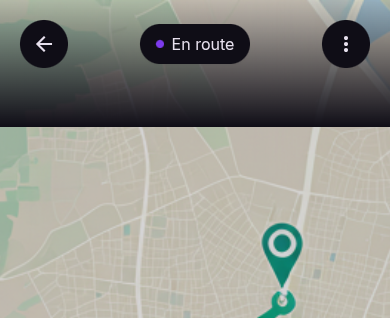

# User Story: US-502 — Realtime Driver GPS Tracking Map

**Story ID:** `US-502`
**Epic:** [EPIC-05: Trip Execution, Real-Time Tracking & Chat](../README.md)
**Role:** Client / Driver
**Priority:** P0

---

## 1. User Story Statement
**As a** Client,
**I want to** track the driver's live GPS position on a map during the trip,
**So that** I can monitor progress in real-time and prepare for package arrival.

---

## 2. Implementation Status
* **Backend:** NOT STARTED — Redis location ingestion and Laravel Reverb broadcasting pipeline pending implementation.
* **Mobile:** NOT STARTED — Map split-screen view with animated driver marker and bottom sheet chat preview pending implementation.

---

## 3. Design System & UI Specs

### Design System Reference Mockups



## 4. Business Rules & Technical Requirements
### 4.1 GPS Ingestion & Redis Caching
* Driver mobile app sends location pings (latitude, longitude, heading, speed) every 5 seconds to `POST /api/v1/trips/{id}/location`.
* The server caches current position in Redis under key `trip:{id}:location` with a 30-second TTL.

### 4.2 Realtime WebSockets Broadcast (Laravel Reverb)
* Ingested location coordinates are broadcast immediately on channel `private-trip.{id}`.
* Client map listens to `TripLocationUpdated` events via Laravel Echo.

### 4.3 Smooth Marker Interpolation
* Mobile map component applies linear interpolation (lerp) over the 5-second interval between coordinate updates to ensure smooth marker movement without erratic jumps.

---

## 5. Acceptance Criteria (Gherkin)

```gherkin
Scenario: Driver app streams GPS location pings every 5 seconds
  Given a trip is active in state "en_route"
  When the driver moves along the route
  Then the driver app sends a location update payload every 5 seconds to the backend
  And the backend caches the coordinate in Redis and broadcasts via Reverb

Scenario: Client views live interpolated driver marker on split-screen map
  Given I am viewing screen "suivi_et_chat" with top 2/3 map view
  When new location coordinates arrive via Laravel Reverb
  Then the driver vehicle marker smoothly interpolates to the new position on the dark map

Scenario: Client opens quick action bar options
  Given I am on the tracking screen "suivi_et_chat"
  When I tap "Call driver"
  Then the device phone dialer launches with the driver's phone number pre-filled
```
