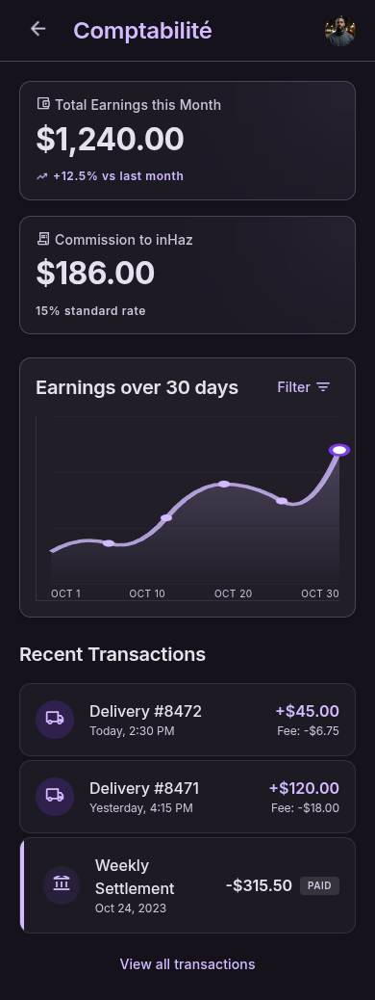

# User Story: US-602 — Platform Commission Ledger & Driver Balance

**Story ID:** `US-602`
**Epic:** [EPIC-06: Payments, Commission & Ratings System](../README.md)
**Role:** Driver & Admin
**Priority:** P0

---

## 1. User Story Statement
**As a** driver,  
**I want to** track my total earnings, platform commission owed, and net balance on a financial accounting dashboard,  
**So that** I understand my financial standing and remain aware of the 200 MAD commission debt limit required to stay online.

---

## 2. Implementation Status
* **Backend:** NOT STARTED — `commission_ledgers` table calculation on `TripCompleted` event and `GET /api/v1/driver/accounting` API endpoint to be built in Laravel 13.
* **Mobile:** NOT STARTED — Driver accounting screen (`comptabilit_livreur`) and debt restriction banner to be implemented in Expo SDK 57.

---

## 3. Design System & UI Specs

### Design System Reference Mockups



## 4. Business Rules & Technical Requirements
### 4.1 Platform Commission Ledger
* Upon trip completion, system calculates commission based on active system setting `commission_rate` (default 12.5%, e.g., 245 MAD trip = 30.63 MAD commission).
* Creates immutable record in `commission_ledgers` table with `trip_id`, `driver_id`, `gross_amount`, `commission_rate`, and `commission_amount`.
* Increments `driver_profiles.commission_balance` by the calculated commission amount.

### 4.2 200 MAD Debt Threshold & Online Lockout
* Maximum allowable driver debt is strictly 200 MAD (`max_driver_debt` in `system_settings`).
* If `driver_profiles.commission_balance > 200.00 MAD`:
  * Driver's `is_online` status is automatically forced to `false`.
  * Mobile toggle switch for "Go Online" is locked with warning modal: *"Vous avez dépassé la limite de commission (200 MAD). Veuillez régler votre solde."*
  * API endpoint `POST /api/v1/driver/toggle-online` returns HTTP 403 Forbidden with code `COMMISSION_DEBT_EXCEEDED`.

---

## 5. Acceptance Criteria (Gherkin)

```gherkin
Scenario: Driver views accounting dashboard with clear debt status
  Given driver has earned "1,200 MAD" with "85 MAD" commission balance owed (<= 200 MAD)
  When driver opens the "Comptabilité" dashboard screen
  Then total earnings, commission owed, and net balance are displayed in dark surface cards (#1F1B24)
  And status badge displays green "Solde régulier" (#00C853)
  And driver can toggle between weekly and monthly date range filters

Scenario: Driver exceeds 200 MAD debt threshold and is blocked from going online
  Given driver commission balance reaches "215 MAD" (> 200 MAD threshold)
  When driver attempts to toggle online status to "ON"
  Then the system blocks the action and displays a red warning modal (#E53935)
  And API returns HTTP 403 Forbidden error "COMMISSION_DEBT_EXCEEDED"
```
