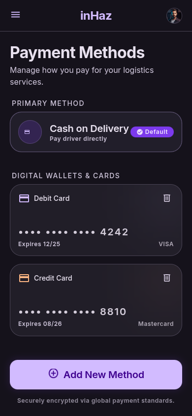

# User Story: US-604 — Payment Method Selection Screen

**Story ID:** `US-604`
**Epic:** [EPIC-06: Payments, Commission & Ratings System](../README.md)
**Role:** Client & Driver
**Priority:** P1

---

## 1. User Story Statement
**As a** platform user,  
**I want to** view and manage my preferred payment methods in profile settings,  
**So that** Cash-on-Delivery is active as default for MVP while digital payment integrations remain clearly indicated.

---

## 2. Implementation Status
* **Backend:** NOT STARTED — User payment preferences API endpoint `GET /api/v1/user/payment-methods` to be implemented in Laravel 13.
* **Mobile:** NOT STARTED — Payment methods selection screen (`modes_de_paiement`) to be built in Expo SDK 57.

---

## 3. Design System & UI Specs

### Design System Reference Mockups



## 4. Business Rules & Technical Requirements
### 4.1 Payment Method Configurations
* Cash-on-Delivery (`cash`) is mandatory and set as the default active payment method for all MVP trips.
* Digital payment methods (`card`, `wallet`) are stored as disabled configuration stubs in the backend response (`enabled: false`).
* Tapping disabled payment method tiles displays an informational toast/banner: *"Les paiements par carte et portefeuille mobile seront disponibles prochainement dans une future mise à jour."*

---

## 5. Acceptance Criteria (Gherkin)

```gherkin
Scenario: User views payment methods in profile settings
  Given user opens "Modes de paiement" from Profile settings
  Then cash payment tile is displayed as active with green badge "Actif (Par défaut)" (#00C853)
  And credit card and mobile wallet tiles are displayed disabled with "Bientôt disponible" badges

Scenario: User attempts to select coming-soon payment method
  Given user is on "Modes de paiement" screen
  When user taps on disabled "Carte Bancaire" tile
  Then a dark toast notification appears stating "Les paiements par carte seront disponibles prochainement."
```
