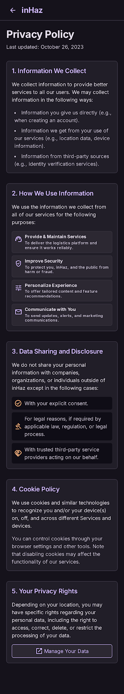

# User Story: US-901 — Privacy Policy & Terms Screen

**Story ID:** `US-901`
**Epic:** [EPIC-09: Legal & App Information Screens](../README.md)
**Role:** All
**Priority:** P1

---

## 1. User Story Statement
**As a** platform client or driver,  
**I want to** read the Privacy Policy and Terms of Service inside the app,  
**So that** I understand how my personal data and freight transactions are governed under Moroccan regulations (CNDP Law 09-08).

---

## 2. Implementation Status
* **Backend:** NOT STARTED — `GET /api/v1/content/privacy` REST API endpoint to be implemented in Laravel 13.
* **Mobile:** NOT STARTED — `politique_de_confidentialit` screen with markdown renderer to be created in Expo SDK 57.

---

## 3. Design System & UI Specs

### Design System Reference Mockups



## 4. Business Rules & Technical Requirements
### 4.1 Content API Endpoint
* `GET /api/v1/content/privacy` returns JSON payload: `{ title, slug, body_markdown, updated_at }`.
* Cached via Laravel Cache; invalidated when admin updates page via Filament CMS editor (US-703).

### 4.2 Multi-Language & Offline Fallback
* Requests content according to `Accept-Language` header (`fr`, `ar`, `en`). Arabic response includes `rtl: true` flag for Expo text alignment.
* Includes local cached fallback markdown bundle in app build in case API request experiences offline network failure.

---

## 5. Acceptance Criteria (Gherkin)

```gherkin
Scenario: User views Privacy Policy in French dark mode
  Given user opens "Politique de confidentialité" from Profile menu
  When screen loads data from GET /api/v1/content/privacy
  Then content is rendered as scrollable markdown on dark card background (#1F1B24)
  And header shows "Dernière mise à jour" date tag

Scenario: User opens Privacy Policy in Arabic RTL mode
  Given user app language is set to Arabic (ar)
  When user opens Privacy Policy screen
  Then text is rendered right-to-left (RTL) with Arabic translation fetched from API
```
