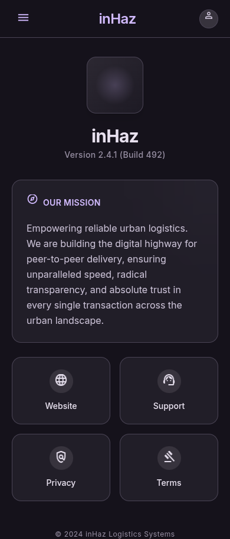

# User Story: US-902 — About inHaz Screen

**Story ID:** `US-902`
**Epic:** [EPIC-09: Legal & App Information Screens](../README.md)
**Role:** All
**Priority:** P2

---

## 1. User Story Statement
**As a** user,  
**I want to** view information about inHaz, its mission, version info, and contact links,  
**So that** I can learn more about the platform and contact support directly.

---

## 2. Implementation Status
* **Backend:** NOT STARTED — `GET /api/v1/content/about` API endpoint to be created in Laravel 13.
* **Mobile:** NOT STARTED — `propos_de_inhaz` screen layout to be built in Expo SDK 57.

---

## 3. Design System & UI Specs

### Design System Reference Mockups



## 4. Business Rules & Technical Requirements
### 4.1 Content Endpoint
* Endpoint `GET /api/v1/content/about` delivers platform details, mission statement markdown, support email, and active social channel links.
* Tapping support email opens native mail composer via Expo Linking.

---

## 5. Acceptance Criteria (Gherkin)

```gherkin
Scenario: User views About inHaz screen details
  Given user opens "À propos de inHaz" screen from profile
  Then app logo, version "v1.0.0", and mission statement card (#1F1B24) are displayed
  And tapping "Email Support" triggers native mail app opening to "support@inhaz.ma"
```
