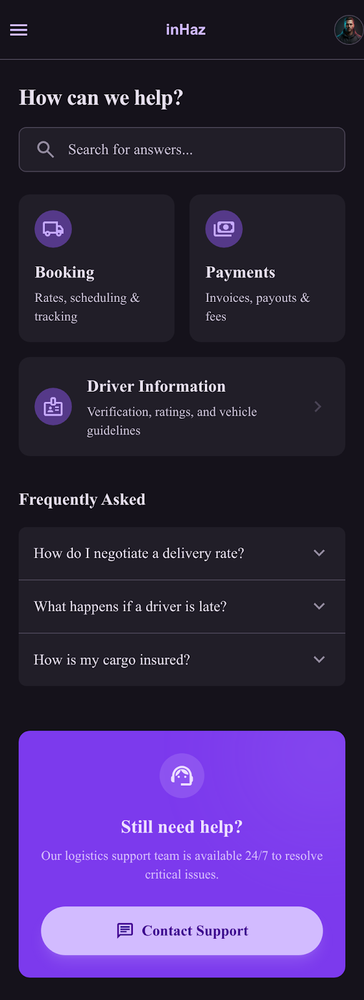

# User Story: US-903 — Help Centre & FAQ Screen

**Story ID:** `US-903`
**Epic:** [EPIC-09: Legal & App Information Screens](../README.md)
**Role:** All
**Priority:** P1

---

## 1. User Story Statement
**As a** client or driver,  
**I want to** browse a categorized FAQ Help Centre with expandable accordion items,  
**So that** I can quickly find answers to common questions regarding delivery requests, cash payments, driver commission, and account management.

---

## 2. Implementation Status
* **Backend:** NOT STARTED — `GET /api/v1/content/faqs` REST API endpoint to be created in Laravel 13.
* **Mobile:** NOT STARTED — Help Centre screen (`centre_d_aide`) with category filter pills and accordion list to be created in Expo SDK 57.

---

## 3. Design System & UI Specs

### Design System Reference Mockups



## 4. Business Rules & Technical Requirements
### 4.1 FAQ API Contract
* Endpoint `GET /api/v1/content/faqs` returns JSON payload categorized array: `[{ id, category, question, answer_markdown, display_order }]`.
* Supports search query parameter `GET /api/v1/content/faqs?q=commission`.

---

## 5. Acceptance Criteria (Gherkin)

```gherkin
Scenario: User searches and expands FAQ item in Help Centre
  Given user opens "Centre d'aide" screen
  When user selects category filter "Paiements"
  And taps on question "Comment fonctionne la commission de 200 MAD ?"
  Then accordion expands to reveal answer explanation in dark card container (#1F1B24)

Scenario: User searches for specific topic
  Given user is on "Centre d'aide" screen
  When user types "annulation" in search bar
  Then FAQ list filters dynamically to show matching cancellation questions
```
