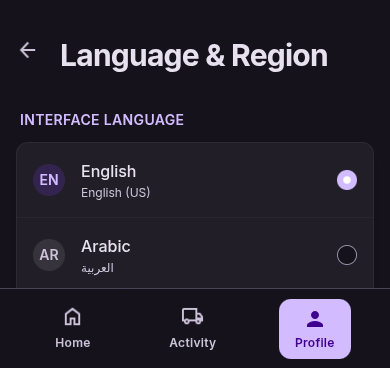

# User Story: US-1002 — Language & Region Settings Screen

**Story ID:** `US-1002`
**Epic:** [EPIC-10: Localisation & Internationalisation (i18n)](../README.md)
**Role:** All
**Priority:** P0

---

## 1. User Story Statement
**As an** inHaz app user,  
**I want to** navigate to a "Langue et Région" settings screen with clear radio options and flag icons,  
**So that** I can customize my application language and regional preference in a dark-mode optimized interface.

---

## 2. Implementation Status
* **Backend:** NOT STARTED — Persistence endpoint (`PATCH /api/v1/profile/locale`) pending.
* **Mobile:** NOT STARTED — `langue_et_r_gion` settings UI screen pending.

---

## 3. Design System & UI Specs

### Design System Reference Mockups



## 4. Business Rules & Technical Requirements

### 4.1 UI Selection & State Updates
* Display current language marked as selected with Electric Purple radio indicator (`#7928CA`).
* Tapping a row instantly updates local Expo i18n instance.
* Triggers an asynchronous API patch to backend `PATCH /api/v1/profile` with payload `{ locale: 'ar' }` to sync `users.locale`.

---

## 5. Acceptance Criteria (Gherkin)

```gherkin
Scenario: Language selection update in Settings
  Given I am on the "Langue et Région" screen with "bg-inhaz-dark" canvas
  When I select the "العربية" option displaying the Morocco flag
  Then the radio button indicator turns Electric Purple ("#7928CA")
  And the mobile application updates its active locale to Arabic
  And an HTTP PATCH request is sent to /api/v1/profile with locale set to "ar"
```
